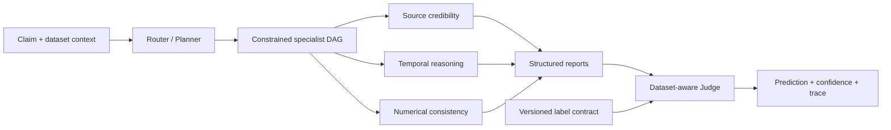
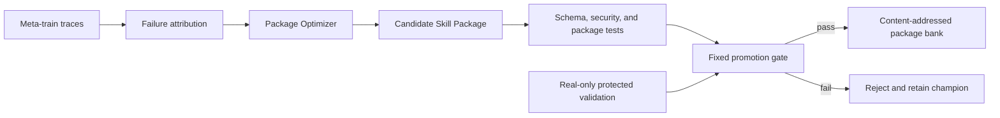

# EvoFactSkill

<p align="center">
  <b>Self-Evolving Multi-Agent System for Misinformation Detection</b>
</p>

<p align="center">
  <a href="README.md">English</a> |
  <a href="README.zh-CN.md">简体中文</a>
</p>

<p align="center">
  <a href="https://github.com/FengyuanYin/EvoFactSkill/actions/workflows/ci.yml"></a>
  = 3.11">
  <a href="LICENSE"></a>
</p>

EvoFactSkill is a research codebase for cross-domain fact verification with an evolvable multi-agent skill bank. A Router builds a constrained dependency graph, specialist agents produce structured analysis reports, and a dataset-aware Judge maps the evidence to the active dataset's label space. Evolution changes complete, versioned Skill Packages—not the weights of the underlying language model—and promotes candidates only after protected validation.

> Paper metadata, pretrained artifacts, and benchmark tables will be added with the public paper release. This README does not report unreleased results or fabricate a citation.

## Highlights

- **Dependency-aware multi-agent execution.** The Router returns a constrained DAG, allowing independent specialists to run concurrently while preserving required expert-to-expert dependencies.
- **Dataset-aware decisions.** Versioned label contracts constrain the Judge to the native labels of Weibo21, AMTCele, LiveFact, or AdvFake. `ABSTAIN` is reserved for Runtime failures and is not treated as a dataset label.
- **Full Skill Package evolution.** Candidate changes may cover `SKILL.md`, manifests, schemas, scripts, and references. Packages are content-addressed, validated, tested, gated, and auditable.
- **Leakage-safe generation.** Real data is split first. Rewriting-based augmentation is restricted to meta-train; meta-test and final-test remain real-only.
- **Reproducible resource accounting.** Runs record calls, tokens, cost availability, concurrency, package digests, label-contract digests, manifests, and traces.

## Method

### Inference



`coordinator_routing` is the Router's skill package; it is not a separate Coordinator agent. The execution plan explicitly represents dependencies. Nodes at the same ready frontier may execute in parallel, while a downstream node waits for its declared predecessors.

### Evolution



The Package Optimizer proposes changes to ordinary agent packages and the generation workflow package. The optimizer package itself is fixed: recursive meta-optimizer self-evolution is intentionally out of scope.

## Installation

Requirements: Python 3.11 or newer.

```bash
git clone https://github.com/FengyuanYin/EvoFactSkill.git
cd EvoFactSkill
python -m venv .venv
```

Activate the environment, then install the project:

```bash
# Linux / macOS
source .venv/bin/activate

# Windows PowerShell
.venv\Scripts\Activate.ps1

python -m pip install -e ".[dev]"
```

No API key is required for the offline smoke test:

```bash
evofact --config configs/dry_run.yaml dry-run --output outputs/dry-run.json
```

## Data preparation

The repository provides adapters but does not redistribute third-party datasets. Obtain each dataset from its official source, follow its license, and place the processed files under the configured `data.root`.

| Dataset ID | Adapter | Intended role |
| --- | --- | --- |
| `weibo21` | `Weibo21Adapter` | Chinese cross-domain misinformation detection |
| `amtcele` | `AMTCeleAdapter` | Dataset-specific label-contract evaluation |
| `livefact` | `LiveFactAdapter` | Dataset-specific label-contract evaluation |
| `advfake` | `AdvFakeAdapter` | Adversarial evaluation and evolution |

Select the dataset and split policy in YAML:

```yaml
data:
  dataset: weibo21
  root: datasets/Weibo21
  train_domains: [domain_a, domain_b]
  final_test_domains: [held_out_domain]
  excluded_domains: [unknown]
```

Inspect normalized samples and create the immutable split manifest before an experiment:

```bash
evofact --config configs/weibo21_cross_domain.yaml data inspect
evofact --config configs/weibo21_cross_domain.yaml \
  data manifest --output outputs/weibo21-manifest.json
```

The manifest contains stable sample fingerprints and disjoint train, evolution-validation, protected-validation, and final-test partitions. Archive it with every reported result.

## Reproducing experiments

All global options must appear before the subcommand. In particular, use `--limit`, `--batch-size`, and `--sample-concurrency` before `test`, `evolve`, or `meta-evolve`.

### Evaluation only

Run a small Weibo21 test:

```bash
evofact \
  --config configs/weibo21_cross_domain.yaml \
  --limit 100 \
  --batch-size 16 \
  --sample-concurrency 8 \
  --progress \
  test --output outputs/weibo21-test.json
```

Run the complete configured test split by omitting `--limit` or setting it to `0`:

```bash
evofact --config configs/weibo21_cross_domain.yaml \
  test --output outputs/weibo21-test.json
```

Override the held-out test domain without editing YAML:

```bash
evofact --config configs/weibo21_cross_domain.yaml \
  test --final-test-domains "domain_x,domain_y" \
  --output outputs/domain-override-test.json
```

The override recomputes the source domains and manifest, then reruns leakage checks.

### Skill evolution

```bash
# One ordinary evolution run
evofact --config configs/weibo21_cross_domain.yaml \
  --limit 400 \
  --batch-size 8 \
  --sample-concurrency 4 \
  evolve \
  --checkpoint outputs/weibo21-evolve-checkpoint.json \
  --trace-log outputs/weibo21-evolve-traces.jsonl \
  --output outputs/evolve.json

# Resume after the last atomically completed batch
evofact --config configs/weibo21_cross_domain.yaml \
  --limit 400 \
  --batch-size 8 \
  --sample-concurrency 4 \
  evolve --resume \
  --checkpoint outputs/weibo21-evolve-checkpoint.json \
  --trace-log outputs/weibo21-evolve-traces.jsonl \
  --output outputs/evolve-resumed.json

# Evaluate proposals and gates without updating the active package bank
evofact --config configs/weibo21_cross_domain.yaml \
  evolve --evaluation-only --output outputs/evolve-evaluation.json

# Cross-domain meta-learning episodes
evofact --config configs/weibo21_cross_domain.yaml \
  meta-evolve --episodes 4 --strategy leave_one_domain_out \
  --trace-log outputs/weibo21-meta-traces.jsonl \
  --output outputs/meta-evolve.json

# Evaluate an existing meta-evolution checkpoint without proposing updates
evofact --config configs/weibo21_cross_domain.yaml \
  meta-evolve --resume --evaluation-only \
  --output outputs/meta-evaluation.json
```

Evolution is batch-style: every sample in one batch uses the same active package snapshot; candidate packages are considered only after the batch/validation boundary. This prevents mid-batch parameter drift.

Every training command writes all detector inference traces to one UTF-8 JSONL log. `evolve` uses a run-ID-specific file by default; `meta-evolve` and `adversarial-evolve` use command-specific files under `output_dir`. Use `--trace-log` to select an explicit path. Each line is a complete `InferenceTrace` plus `training_context` containing the run ID, task, phase, sequence number, sample position, and active Skill IDs. The same file therefore includes training forward passes, counterfactual passes, validation baselines, candidate validation, meta-train, meta-test, and adversarial detector probes. Generator request/response audits remain in the generation audit store because they are not detector `InferenceTrace` objects.

The recommended persistent setting is `execution.trace_log` in the experiment YAML. `--trace-log` remains an optional one-run override. Resolution order is CLI override, checkpoint-recorded path during resume, YAML path, then the command default:

```yaml
execution:
  batch_size: 16
  max_concurrent_samples: 16
  progress: auto
  trace_log: outputs/weibo21_cross_domain_4/training-traces.jsonl
```

A fresh run truncates its selected trace log. `--resume` appends to the checkpoint-recorded log and refuses a missing or different file, preventing a resumed experiment from silently splitting traces across files. An interrupted, uncommitted batch can appear twice after resume; those records are intentionally retained as API-usage audit evidence and are distinguishable by `training_context.sequence` and phase.

`meta-evolve` additionally supports frequent, bounded candidate updates inside each
meta-training episode. These controls do not alter `test` or its inference path:

```yaml
evolution:
  update_interval_samples: 25
  max_proposals_per_update: 1
  max_attribution_samples_per_update: 8
  max_counterfactuals_per_sample: 1

meta_learning:
  evaluation_repeats: 1
  max_meta_test_samples_per_domain: 10
  isolate_candidate_budget: true
```

For each leave-one-domain-out episode, the active Package Bank remains frozen while
the meta-train partition is consumed in 25-sample updates. Each update can emit at
most one candidate, attribution is restricted to at most eight failed samples, and
each selected sample triggers at most one counterfactual inference. Candidates are
then evaluated on a deterministic, domain-balanced subset of the held-out source
domain. The true `data.final_test_domains` never enter candidate generation or the
Meta Gate. A zero value restores the legacy unbounded/full-partition behavior;
`evaluation_repeats: 0` inherits `gate.repeats`. Candidate budget isolation gives
each baseline/candidate comparison its own per-sample allowance while preserving
the cumulative run-level call, token, and cost budgets.

The forward pipeline and the training-only Package Optimizer may use different
OpenAI-compatible endpoints. Weibo21 configurations keep the inexpensive forward
model in the existing top-level fields and resolve the optimizer endpoint from
separate environment variables:

```powershell
$env:DEEPSEEK_API_KEY = "<forward-api-key>"
$env:EVOFACT_OPTIMIZER_BASE_URL = "https://<optimizer-provider>/v1"
$env:EVOFACT_OPTIMIZER_MODEL = "<advanced-model>"
$env:EVOFACT_OPTIMIZER_API_KEY = "<optimizer-api-key>"
$env:EVOFACT_OPTIMIZER_PRICING_TABLE = "pricing/<optimizer-pricing>.json"
```

```yaml
optimizer_backend:
  enabled: true
  backend: openai-compatible
  model_env: EVOFACT_OPTIMIZER_MODEL
  base_url_env: EVOFACT_OPTIMIZER_BASE_URL
  api_key_env: EVOFACT_OPTIMIZER_API_KEY
  provider: openai-compatible
  pricing_table_path_env: EVOFACT_OPTIMIZER_PRICING_TABLE
  temperature: 1.0
```

Router, Specialist, Judge, counterfactual inference, Meta-test, and final test keep
using the top-level forward model. Only `PackageOptimizerAgent` uses the optimizer
backend. When cost-aware promotion is enabled, the optimizer pricing table is
mandatory and its `provider` must match `optimizer_backend.provider`. Checkpoints
and Skill Bank provenance record both resolved model names and endpoint identities,
but never API keys. Resume fails if the effective model/pricing identity changes.

For a configured cross-domain dataset, `--limit` is the **total source-training budget**, not a per-domain limit and not a final-test limit. The sampler allocates it as evenly as possible across `data.train_domains` using the experiment seed. With the eight Weibo21 source domains, `--limit 400` selects 50 training samples from each domain. If a domain lacks its nominal quota, the deficit is deterministically reassigned to domains with remaining samples and disclosed in `data_sampling.selected_by_domain`.

The protected final-test set is configured independently:

```yaml
data:
  train_sampling: balanced_by_domain
  final_test_samples_per_domain: 100
  static_test_pattern: outputs/static/{dataset}-test-{domain}.json
  require_static_test: true
```

For Weibo21, the runtime reads the ordered `sample_id` values from the matching result under `outputs/static/`. Each final-test domain must provide at least 100 valid static samples: exactly 100 are retained when the file contains 100, and only the first 100 are retained when it contains more. Fewer than 100 is an error. Therefore, five final-test domains produce 500 test samples rather than sharing one 100-sample budget. The runtime also fails before inference if a required file is missing, an ID is absent from the currently loaded dataset, or an ID belongs to another domain. This prevents an evolved system from being evaluated on a different final-test set than the static baseline. The sampler itself is dataset-independent: AMTCele, MCFEND, and LiveFact can use the same policy after their adapters and configuration provide stable dataset IDs, domains, and a matching static-test pattern.

#### Resumable evolution protocol

Ordinary evolution writes an atomic checkpoint only after a batch has completed and its accepted Package Bank update has been committed. A checkpoint contains the number and audit records of completed batches, the exact active package mapping, accumulated traces and sample evaluations, optimizer and gate outputs, and the consumed budget state. Consequently, a resumed run preserves both the final evaluation denominator and the resource ledger of the interrupted run.

Resume is deliberately fail-closed. Before skipping any batch, the runtime verifies the complete effective configuration, configuration-file digest, data manifest, ordered train/validation sample identifiers, active Package Bank, and checkpoint schema. The resumed command must therefore use the same YAML file contents, `--limit`, `--batch-size`, sample selection, split, and Skill Bank as the original command. `--sample-concurrency` is part of the effective configuration and must also remain unchanged. A batch interrupted before its checkpoint is written is executed again; already committed batches are not repeated. A checkpoint marked `complete` is terminal, and `--evaluation-only` runs are not resumable because they use an isolated temporary bank.

This protocol provides batch-boundary recovery rather than instruction-level replay. Calls issued inside an interrupted, uncommitted batch may be repeated after recovery and should be considered when reporting API usage.

#### Training provenance and Skill Bank identity

Each committed Package Bank carries machine-readable provenance. The following identifiers have distinct experimental meanings:

| Identifier | Scope | Intended use |
| --- | --- | --- |
| `training_run_id` | One concrete evolution invocation; restored unchanged by resume | Distinguish repeated runs of the same experimental configuration |
| `identity_digest` | Effective configuration, configuration file, manifest, train/validation sample sets, and limit | Detect whether two runs implement the same experimental design |
| `bank_digest` | The complete coherent Package Bank | Select and cite the exact Router/Specialist/Judge system used for inference |
| `package_digest` | One content-addressed Skill Package | Audit the exact files of an individual agent package |
| semantic version | Human-readable package release label | Describe changes; not sufficient by itself for exact reproduction |

The provenance record also contains the effective configuration, configuration-file digest, manifest ID, split fingerprints and sample counts, random seed through the effective configuration, starting bank digest, exact starting package digests and versions, and per-batch proposal/gate audit. Thus, scientific results should be reported with at least the source commit, dataset manifest ID, `training_run_id`, `identity_digest`, and final `bank_digest`.

Inspect the active bank and immutable transaction history with:

```bash
evofact --config configs/weibo21_cross_domain.yaml skills banks
evofact --config configs/weibo21_cross_domain.yaml skills bank-show active
evofact --config configs/weibo21_cross_domain.yaml \
  skills bank-export active --output outputs/weibo21-skill-bank-lock.json
```

`skills bank-show` reports package versions, exact digests, the originating run when available, and recorded provenance. `skills bank-export` writes a `skill_bank_lock_v1` lock file. The lock records identities rather than copying package contents, so the referenced content-addressed blobs must remain available in the configured `skill_store`.

#### Version-controlled inference

Inference uses the active bank by default. For a publishable or repeated experiment, export a lock file and retain it with the experiment artifacts. Place `--skill-bank` before the subcommand and select a training run ID, bank digest, or lock file to reconstruct one coherent Router/Specialist/Judge bank:

```bash
# Recommended: exported immutable lock
evofact --config configs/weibo21_cross_domain.yaml \
  --skill-bank outputs/weibo21-skill-bank-lock.json \
  test --output outputs/weibo21-locked-bank-test.json

# Equivalent selectors when the repository history is available
evofact --config configs/weibo21_cross_domain.yaml \
  --skill-bank evolve-<identity>-<run> \
  test --output outputs/weibo21-run-id-test.json

evofact --config configs/weibo21_cross_domain.yaml \
  --skill-bank <bank-digest> \
  test --output outputs/weibo21-bank-digest-test.json
```

The test report embeds the resolved bank digest, semantic versions, package digests, and available training provenance. Individual package overrides are intentionally unsupported because mixing agents from different training snapshots would invalidate the system-level experimental identity. Banks created before provenance tracking was introduced remain loadable, but their missing provenance cannot be reconstructed retrospectively and must be disclosed when reporting results.

### Unified paired ablations

```bash
evofact --config configs/weibo21_cross_domain.yaml \
  ablation \
  --arms "full,no-evolution,instructions-only,no-discovery,rule-proposer" \
  --seeds 5 \
  --bootstrap-iterations 2000 \
  --output outputs/evolution-ablation.json
```

Every arm starts from the same seed packages, uses the same manifest and protected final-test sample order, and writes only to an isolated temporary package bank. The report contains effective mechanism settings, per-seed metrics, McNemar tests, paired bootstrap confidence intervals, package-bank digests, and budget snapshots. `no-evolution`, `no-discovery`, `rule-proposer`, and `no-evidence` are paired against `full`; `instructions-only` is paired against `no-discovery` so package scope is the only changed factor. `no-evidence` is accepted only for evidence-bearing data. `rule-proposer` is valid only when the full configuration uses the LLM proposer. DEMSE additionally supports `--ablation no-negative-transfer-constraint`.

The same command also accepts `meta-full` with `meta-no-cross-episode-aggregation`, `meta-no-negative-transfer-constraint`, `meta-no-worst-domain-constraint`, or `meta-no-specialization`; and `generation-full` with `generation-real-only` or `generation-rule-proposer`. Generation arms require evidence facts through `--facts`. The `unified_ablation_v2` report contains all families, one flattened run list, one summary table, and episode-paired bootstrap intervals for meta/generation controls.

### Adversarial and generator evolution

```bash
# Adversarial evolution from normalized samples and verified facts
evofact --config configs/adversarial_llm.yaml \
  adversarial-evolve \
  --samples data/adversarial/samples.jsonl \
  --facts data/adversarial/facts.jsonl \
  --trace-log outputs/adversarial-evolve-traces.jsonl \
  --output outputs/adversarial-evolve.json

# Inspect a generation audit
evofact generation audit outputs/generation-audit.json

# Let the Package Optimizer propose a generation_agent candidate
evofact --config configs/adversarial_llm.yaml \
  generator-evolve --audit outputs/generation-audit.json --propose-only

# Evaluate and gate a serialized candidate
evofact --config configs/adversarial_llm.yaml \
  generator-evolve \
  --candidate outputs/generator-candidate.json \
  --evaluation outputs/generator-evaluation.json
```

Generated examples must preserve source lineage and pass the generation audit. The supported protocol is:

1. Split the real samples first.
2. Rewrite only real meta-train samples.
3. Combine real meta-train and accepted generated meta-train samples.
4. Keep meta-test, protected validation, and final-test real-only.

### Reports

```bash
evofact --config configs/weibo21_cross_domain.yaml \
  report --output outputs/report.json
```

`test`, `evolve`, `meta-evolve`, and `adversarial-evolve` emit UTF-8 JSON when `--output` is provided. Reports include aggregate metrics, per-domain/schema slices, resource usage, trace references, active package digests, and manifest identity when available.

## Evaluation protocol

The primary classification metrics are:

| Metric | Meaning |
| --- | --- |
| `accuracy_all` | Accuracy over every labeled sample, including Runtime failures |
| `macro_f1_all` | Schema-aware macro F1 over every labeled sample |
| `coverage` | Fraction receiving a valid non-Runtime dataset label |
| `covered_accuracy` | Accuracy only on covered samples |
| `selective_risk` | `1 - covered_accuracy` |
| `ece` | Expected calibration error |
| `brier` | Brier score, only for a binary schema with a declared positive label |
| `evidence_coverage` | Fraction of samples with evidence available to the system |
| `mean_cost` | Mean priced backend cost when the pricing table is available |

Always report `accuracy_all` and `macro_f1_all` with `coverage`. A high `covered_accuracy` is not meaningful if the Runtime rejects many difficult cases. `evidence_coverage = 0` indicates a no-external-evidence setting and must not be described as evidence-grounded verification.

`ABSTAIN` is a Runtime outcome for exhausted budgets, timeouts, missing required reports, or an invalid Judge response. It is not a legal label supplied to the Judge. Label order, native mappings, and optional positive labels come from versioned dataset contracts.

For datasets such as Weibo21 that do not provide an external `evidence` field, the adapter normalizes evidence to an empty collection. The Runtime marks evidence-assessment nodes optional, passes `evidence_mode: unavailable` to the Judge, and requires the Judge to decide from the claim text plus successful non-evidence specialist reports. Missing evidence alone never triggers `ABSTAIN`; `evidence_coverage` remains zero, so the run cannot be described as evidence-grounded.

## Configuration and budgets

The main experiment controls live in YAML:

```yaml
backend: openai-compatible
model: your-model-name
base_url: https://your-provider.example/v1
api_key_env: PROVIDER_API_KEY

execution:
  batch_size: 16
  max_concurrent_samples: 8
  progress: auto
  trace_log: outputs/experiment/training-traces.jsonl

evolution:
  enabled: true
  proposer: llm
  scope: package          # package | instructions
  discovery: true

budget:
  max_calls_per_run: 10000

pricing:
  provider: your-provider
  table_path: pricing/provider-date.json
  require_cost_for_promotion: true
```

For the generation-data control arm, set `generation.use_generated_in_training: false`. Generation and verification still run and remain audited, but only real construction samples enter detector evolution. `generation.proposer: rule` selects a deterministic, label-preserving surface-form baseline; its outputs still pass through the same firewall and blind verifier as LLM-generated samples.

Store credentials only in the environment variable named by `api_key_env`:

```bash
# Linux / macOS
export PROVIDER_API_KEY="..."

# Windows PowerShell
$env:PROVIDER_API_KEY="..."
```

Calls, tokens, priced cost, and concurrency are enforced at Runtime boundaries. Pricing snapshots are dated; refresh and archive the applicable provider table before a publication run.

## Skill packages and extensibility

Seed packages live in `skills/seeds/`. A package may contain:

```text
skill_name/
├── SKILL.md
├── metadata.json
├── scripts/
├── references/
└── schemas/
```

Specialists are discovered from validated package manifests and report schemas rather than a hard-coded Python role list. A new specialist must declare its kind, scope, triggers, capability contract, instruction entry point, and structured output schema. The Router may then select it when its contract matches the claim and dataset context.

Useful inspection commands:

```bash
evofact skills list
evofact package validate skills/seeds/temporal_reasoning
evofact package test skills/seeds/temporal_reasoning
evofact package diff path/to/before path/to/after
```

## Repository layout

```text
EvoFactSkill/
├── configs/              # experiment configurations
├── pricing/              # dated provider pricing snapshots
├── skills/
│   ├── seeds/            # initial Router, specialist, Judge, generator, optimizer packages
│   └── store*/           # content-addressed evolved package banks
├── src/evofact/
│   ├── data/             # adapters, label contracts, manifests, leakage checks
│   ├── runtime/          # routing, DAG execution, backend, budgets, traces
│   ├── evolution/        # attribution and full-package optimization
│   ├── generation/       # rewriting, verification, and generation audit
│   ├── experiments/      # test, evolution, meta-learning, adversarial runners
│   ├── validation/       # fixed gates, calibration, transfer checks
│   └── reporting/        # machine-readable experiment reports
└── tests/                # offline unit, integration, and contract tests
```

## Testing

The test suite is offline and uses injected fake backends; it does not call a paid API.

```bash
python -m pytest
python -m ruff check src tests
```

For a real backend, first validate orchestration with a small `--limit` and a strict budget. Do not infer benchmark quality from the mock backend or the dry-run fixture.

## Scope and limitations

- The repository evolves Skill Packages, not foundation-model weights.
- The Package Optimizer is fixed; self-evolution of the optimizer is not implemented.
- Retrieval is not bundled. Evidence snapshots must be provided by the dataset/workflow, and evidence-free results must be reported as such.
- The unified ablation runner covers ordinary Skill evolution, DEMSE controls, and adversarial-generation controls under one report contract.
- Dataset access, licenses, and processed-release hashes remain the experimenter's responsibility.
- Real-provider results depend on model version, rate limits, and a dated pricing snapshot.

## Citation

The paper citation will be added after the paper is publicly available. Until then, cite the repository URL and the exact commit used for the experiment.

## License

This project is released under the [MIT License](LICENSE). Third-party datasets and model providers retain their own terms.
