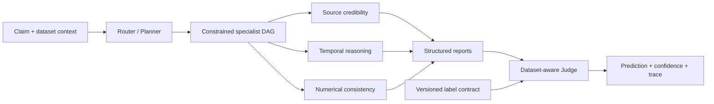
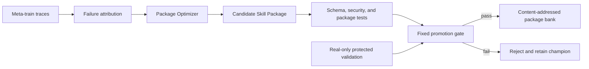

# EvoFactSkill

<p align="center">
  <b>Dataset-Aware Full-Package Evolution for Multi-Agent Fact Verification</b>
</p>

<p align="center">
  <a href="README.md">English</a> |
  <a href="README.zh-CN.md">简体中文</a>
</p>

<p align="center">
  <a href="https://github.com/FengyuanYin/EvoFactSkill/actions/workflows/ci.yml"></a>
  = 3.11">
  <a href="LICENSE"></a>
</p>

EvoFactSkill is a research codebase for cross-domain fact verification with an evolvable multi-agent skill bank. A Router builds a constrained dependency graph, specialist agents produce structured analysis reports, and a dataset-aware Judge maps the evidence to the active dataset's label space. Evolution changes complete, versioned Skill Packages—not the weights of the underlying language model—and promotes candidates only after protected validation.

> Paper metadata, pretrained artifacts, and benchmark tables will be added with the public paper release. This README does not report unreleased results or fabricate a citation.

## Highlights

- **Dependency-aware multi-agent execution.** The Router returns a constrained DAG, allowing independent specialists to run concurrently while preserving required expert-to-expert dependencies.
- **Dataset-aware decisions.** Versioned label contracts constrain the Judge to the native labels of Weibo21, AMTCele, LiveFact, or AdvFake. `ABSTAIN` is reserved for Runtime failures and is not treated as a dataset label.
- **Full Skill Package evolution.** Candidate changes may cover `SKILL.md`, manifests, schemas, scripts, and references. Packages are content-addressed, validated, tested, gated, and auditable.
- **Leakage-safe generation.** Real data is split first. Rewriting-based augmentation is restricted to meta-train; meta-test and final-test remain real-only.
- **Reproducible resource accounting.** Runs record calls, tokens, cost availability, concurrency, package digests, label-contract digests, manifests, and traces.

## Method

### Inference



`coordinator_routing` is the Router's skill package; it is not a separate Coordinator agent. The execution plan explicitly represents dependencies. Nodes at the same ready frontier may execute in parallel, while a downstream node waits for its declared predecessors.

### Evolution



The Package Optimizer proposes changes to ordinary agent packages and the generation workflow package. The optimizer package itself is fixed: recursive meta-optimizer self-evolution is intentionally out of scope.

## Installation

Requirements: Python 3.11 or newer.

```bash
git clone https://github.com/FengyuanYin/EvoFactSkill.git
cd EvoFactSkill
python -m venv .venv
```

Activate the environment, then install the project:

```bash
# Linux / macOS
source .venv/bin/activate

# Windows PowerShell
.venv\Scripts\Activate.ps1

python -m pip install -e ".[dev]"
```

No API key is required for the offline smoke test:

```bash
evofact --config configs/dry_run.yaml dry-run --output outputs/dry-run.json
```

## Data preparation

The repository provides adapters but does not redistribute third-party datasets. Obtain each dataset from its official source, follow its license, and place the processed files under the configured `data.root`.

| Dataset ID | Adapter | Intended role |
| --- | --- | --- |
| `weibo21` | `Weibo21Adapter` | Chinese cross-domain misinformation detection |
| `amtcele` | `AMTCeleAdapter` | Dataset-specific label-contract evaluation |
| `livefact` | `LiveFactAdapter` | Dataset-specific label-contract evaluation |
| `advfake` | `AdvFakeAdapter` | Adversarial evaluation and evolution |

Select the dataset and split policy in YAML:

```yaml
data:
  dataset: weibo21
  root: datasets/Weibo21
  train_domains: [domain_a, domain_b]
  final_test_domains: [held_out_domain]
  excluded_domains: [unknown]
```

Inspect normalized samples and create the immutable split manifest before an experiment:

```bash
evofact --config configs/weibo21_cross_domain.yaml data inspect
evofact --config configs/weibo21_cross_domain.yaml \
  data manifest --output outputs/weibo21-manifest.json
```

The manifest contains stable sample fingerprints and disjoint train, evolution-validation, protected-validation, and final-test partitions. Archive it with every reported result.

## Reproducing experiments

All global options must appear before the subcommand. In particular, use `--limit`, `--batch-size`, and `--sample-concurrency` before `test`, `evolve`, or `meta-evolve`.

### Evaluation only

Run a small Weibo21 test:

```bash
evofact \
  --config configs/weibo21_cross_domain.yaml \
  --limit 100 \
  --batch-size 16 \
  --sample-concurrency 8 \
  --progress \
  test --output outputs/weibo21-test.json
```

Run the complete configured test split by omitting `--limit` or setting it to `0`:

```bash
evofact --config configs/weibo21_cross_domain.yaml \
  test --output outputs/weibo21-test.json
```

Override the held-out test domain without editing YAML:

```bash
evofact --config configs/weibo21_cross_domain.yaml \
  test --final-test-domains "domain_x,domain_y" \
  --output outputs/domain-override-test.json
```

The override recomputes the source domains and manifest, then reruns leakage checks.

### Skill evolution

```bash
# One ordinary evolution run
evofact --config configs/weibo21_cross_domain.yaml \
  evolve --output outputs/evolve.json

# Cross-domain meta-learning episodes
evofact --config configs/weibo21_cross_domain.yaml \
  meta-evolve --episodes 8 --strategy leave_one_domain_out \
  --output outputs/meta-evolve.json

# Evaluate an existing meta-evolution checkpoint without proposing updates
evofact --config configs/weibo21_cross_domain.yaml \
  meta-evolve --resume --evaluation-only \
  --output outputs/meta-evaluation.json
```

Evolution is batch-style: every sample in one batch uses the same active package snapshot; candidate packages are considered only after the batch/validation boundary. This prevents mid-batch parameter drift.

### Adversarial and generator evolution

```bash
# Adversarial evolution from normalized samples and verified facts
evofact --config configs/adversarial_llm.yaml \
  adversarial-evolve \
  --samples data/adversarial/samples.jsonl \
  --facts data/adversarial/facts.jsonl \
  --output outputs/adversarial-evolve.json

# Inspect a generation audit
evofact generation audit outputs/generation-audit.json

# Let the Package Optimizer propose a generation_agent candidate
evofact --config configs/adversarial_llm.yaml \
  generator-evolve --audit outputs/generation-audit.json --propose-only

# Evaluate and gate a serialized candidate
evofact --config configs/adversarial_llm.yaml \
  generator-evolve \
  --candidate outputs/generator-candidate.json \
  --evaluation outputs/generator-evaluation.json
```

Generated examples must preserve source lineage and pass the generation audit. The supported protocol is:

1. Split the real samples first.
2. Rewrite only real meta-train samples.
3. Combine real meta-train and accepted generated meta-train samples.
4. Keep meta-test, protected validation, and final-test real-only.

### Reports

```bash
evofact --config configs/weibo21_cross_domain.yaml \
  report --output outputs/report.json
```

`test`, `evolve`, `meta-evolve`, and `adversarial-evolve` emit UTF-8 JSON when `--output` is provided. Reports include aggregate metrics, per-domain/schema slices, resource usage, trace references, active package digests, and manifest identity when available.

## Evaluation protocol

The primary classification metrics are:

| Metric | Meaning |
| --- | --- |
| `accuracy_all` | Accuracy over every labeled sample, including Runtime failures |
| `macro_f1_all` | Schema-aware macro F1 over every labeled sample |
| `coverage` | Fraction receiving a valid non-Runtime dataset label |
| `covered_accuracy` | Accuracy only on covered samples |
| `selective_risk` | `1 - covered_accuracy` |
| `ece` | Expected calibration error |
| `brier` | Brier score, only for a binary schema with a declared positive label |
| `evidence_coverage` | Fraction of samples with evidence available to the system |
| `mean_cost` | Mean priced backend cost when the pricing table is available |

Always report `accuracy_all` and `macro_f1_all` with `coverage`. A high `covered_accuracy` is not meaningful if the Runtime rejects many difficult cases. `evidence_coverage = 0` indicates a no-external-evidence setting and must not be described as evidence-grounded verification.

`ABSTAIN` is a Runtime outcome for exhausted budgets, timeouts, missing required reports, or an invalid Judge response. It is not a legal label supplied to the Judge. Label order, native mappings, and optional positive labels come from versioned dataset contracts.

## Configuration and budgets

The main experiment controls live in YAML:

```yaml
backend: openai-compatible
model: your-model-name
base_url: https://your-provider.example/v1
api_key_env: PROVIDER_API_KEY

execution:
  batch_size: 16
  max_concurrent_samples: 8
  progress: auto

budget:
  max_calls_per_run: 10000
  max_tokens_per_run: 30000000

pricing:
  provider: your-provider
  table_path: pricing/provider-date.json
  require_cost_for_promotion: true
```

Store credentials only in the environment variable named by `api_key_env`:

```bash
# Linux / macOS
export PROVIDER_API_KEY="..."

# Windows PowerShell
$env:PROVIDER_API_KEY="..."
```

Calls, tokens, priced cost, and concurrency are enforced at Runtime boundaries. Pricing snapshots are dated; refresh and archive the applicable provider table before a publication run.

## Skill packages and extensibility

Seed packages live in `skills/seeds/`. A package may contain:

```text
skill_name/
├── SKILL.md
├── metadata.json
├── scripts/
├── references/
└── schemas/
```

Specialists are discovered from validated package manifests and report schemas rather than a hard-coded Python role list. A new specialist must declare its kind, scope, triggers, capability contract, instruction entry point, and structured output schema. The Router may then select it when its contract matches the claim and dataset context.

Useful inspection commands:

```bash
evofact skills list
evofact package validate skills/seeds/temporal_reasoning
evofact package test skills/seeds/temporal_reasoning
evofact package diff path/to/before path/to/after
```

## Repository layout

```text
EvoFactSkill/
├── configs/              # experiment configurations
├── pricing/              # dated provider pricing snapshots
├── skills/
│   ├── seeds/            # initial Router, specialist, Judge, generator, optimizer packages
│   └── store*/           # content-addressed evolved package banks
├── src/evofact/
│   ├── data/             # adapters, label contracts, manifests, leakage checks
│   ├── runtime/          # routing, DAG execution, backend, budgets, traces
│   ├── evolution/        # attribution and full-package optimization
│   ├── generation/       # rewriting, verification, and generation audit
│   ├── experiments/      # test, evolution, meta-learning, adversarial runners
│   ├── validation/       # fixed gates, calibration, transfer checks
│   └── reporting/        # machine-readable experiment reports
└── tests/                # offline unit, integration, and contract tests
```

## Testing

The test suite is offline and uses injected fake backends; it does not call a paid API.

```bash
python -m pytest
python -m ruff check src tests
```

For a real backend, first validate orchestration with a small `--limit` and a strict budget. Do not infer benchmark quality from the mock backend or the dry-run fixture.

## Scope and limitations

- The repository evolves Skill Packages, not foundation-model weights.
- The Package Optimizer is fixed; self-evolution of the optimizer is not implemented.
- Retrieval is not bundled. Evidence snapshots must be provided by the dataset/workflow, and evidence-free results must be reported as such.
- Generic paper-level ablation is fail-closed. Only ablations with independent execution switches and a shared manifest/metric implementation are valid.
- Dataset access, licenses, and processed-release hashes remain the experimenter's responsibility.
- Real-provider results depend on model version, rate limits, and a dated pricing snapshot.

## Citation

The paper citation will be added after the paper is publicly available. Until then, cite the repository URL and the exact commit used for the experiment.

## License

This project is released under the [MIT License](LICENSE). Third-party datasets and model providers retain their own terms.
