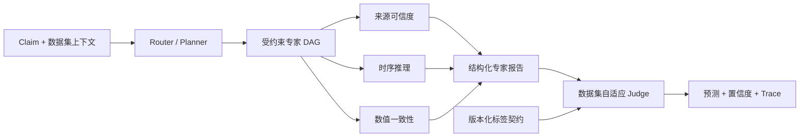
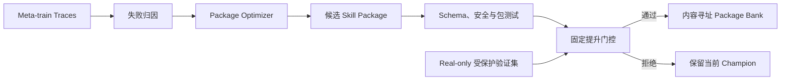

# EvoFactSkill

<p align="center">
  <b>面向虚假信息检测的自进化多智能体系统</b>
</p>

<p align="center">
  <a href="README.md">English</a> |
  <a href="README.zh-CN.md">简体中文</a>
</p>

<p align="center">
  <a href="https://github.com/FengyuanYin/EvoFactSkill/actions/workflows/ci.yml"></a>
  = 3.11">
  <a href="LICENSE"></a>
</p>

EvoFactSkill 是一个用于跨领域事实核验的研究型代码库，核心是可演化的多智能体 Skill Bank。Router 构造受约束的依赖图，专家智能体输出结构化分析报告，数据集自适应 Judge 再根据当前数据集的标签空间完成判定。演化对象是完整、版本化的 Skill Package，而不是底层大语言模型的权重；候选包只有通过受保护验证后才会被提升。

> 论文元数据、预训练产物和正式结果表将在论文公开时补充。本 README 不展示尚未发布的实验结果，也不虚构论文引用。

## 核心特点

- **依赖感知的多智能体执行。** Router 返回受约束 DAG：相互独立的专家可以并行执行，存在前后依赖的专家严格按拓扑顺序执行。
- **数据集自适应判定。** 版本化标签契约把 Judge 的输出限制在 Weibo21、AMTCele、LiveFact 或 AdvFake 的原生标签空间中。`ABSTAIN` 只表示 Runtime 故障，不是数据集标签。
- **完整 Skill Package 演化。** 候选修改可以覆盖 `SKILL.md`、manifest、schema、script 和 reference，并经过内容寻址、校验、测试、门控和审计。
- **防泄漏的数据增强。** 先划分真实数据，再仅对 meta-train 执行基于真实样本的 rewriting；meta-test 和 final-test 始终保持 real-only。
- **可复现的资源核算。** 运行记录 calls、tokens、成本可用性、并发度、package digest、label-contract digest、manifest 和 trace。

## 方法概览

### 推理链路



`coordinator_routing` 是 Router 使用的 Skill Package，并不存在一个独立的 Coordinator Agent。执行计划显式记录专家依赖关系：同一就绪层中的节点可以并行，后继节点必须等待其声明的前驱完成。

### 演化链路



Package Optimizer 可以为普通 Agent Package 和 generation workflow package 提出候选修改。Optimizer 自身保持固定，当前设计不启用递归的 Meta Optimizer 自演化，从而避免无限套娃和评估边界漂移。

## 安装

环境要求：Python 3.11 或更高版本。

```bash
git clone https://github.com/FengyuanYin/EvoFactSkill.git
cd EvoFactSkill
python -m venv .venv
```

激活环境并安装项目：

```bash
# Linux / macOS
source .venv/bin/activate

# Windows PowerShell
.venv\Scripts\Activate.ps1

python -m pip install -e ".[dev]"
```

离线冒烟测试不需要 API Key：

```bash
evofact --config configs/dry_run.yaml dry-run --output outputs/dry-run.json
```

## 数据准备

仓库提供数据适配器，但不重新分发第三方数据集。请从数据集官方来源获取数据、遵守对应许可证，并把处理后的文件放到配置项 `data.root` 指定的位置。

| Dataset ID | Adapter | 用途 |
| --- | --- | --- |
| `weibo21` | `Weibo21Adapter` | 中文跨领域虚假信息检测 |
| `amtcele` | `AMTCeleAdapter` | 数据集标签契约评测 |
| `livefact` | `LiveFactAdapter` | 数据集标签契约评测 |
| `advfake` | `AdvFakeAdapter` | 对抗评测与演化 |

在 YAML 中选择数据集并配置领域划分：

```yaml
data:
  dataset: weibo21
  root: datasets/Weibo21
  train_domains: [domain_a, domain_b]
  final_test_domains: [held_out_domain]
  excluded_domains: [unknown]
```

正式实验前，先检查标准化样本并生成不可变的划分 manifest：

```bash
evofact --config configs/weibo21_cross_domain.yaml data inspect
evofact --config configs/weibo21_cross_domain.yaml \
  data manifest --output outputs/weibo21-manifest.json
```

Manifest 保存稳定的样本指纹，以及互不重叠的 train、evolution-validation、protected-validation 和 final-test 分区。论文结果必须连同对应 manifest 一起归档。

## 复现实验

所有全局参数必须放在子命令之前，尤其是 `--limit`、`--batch-size` 和 `--sample-concurrency`。

### 仅测试现有 Skill

在 Weibo21 上测试 100 条样本：

```bash
evofact \
  --config configs/weibo21_cross_domain.yaml \
  --limit 100 \
  --batch-size 16 \
  --sample-concurrency 8 \
  --progress \
  test --output outputs/weibo21-test.json
```

省略 `--limit` 或设置为 `0`，即可测试完整的配置分区：

```bash
evofact --config configs/weibo21_cross_domain.yaml \
  test --output outputs/weibo21-test.json
```

不修改 YAML，直接覆盖最终测试领域：

```bash
evofact --config configs/weibo21_cross_domain.yaml \
  test --final-test-domains "domain_x,domain_y" \
  --output outputs/domain-override-test.json
```

覆盖后系统会重新计算源领域和 manifest，并重新执行数据泄漏检查。

### Skill 演化

```bash
# 单轮普通演化
evofact --config configs/weibo21_cross_domain.yaml \
  evolve --output outputs/evolve.json

# 只评估提案和门控，不更新 active package bank
evofact --config configs/weibo21_cross_domain.yaml \
  evolve --evaluation-only --output outputs/evolve-evaluation.json

# 跨领域元学习 episode
evofact --config configs/weibo21_cross_domain.yaml \
  meta-evolve --episodes 8 --strategy leave_one_domain_out \
  --output outputs/meta-evolve.json

# 不提出新修改，仅评估已有 checkpoint
evofact --config configs/weibo21_cross_domain.yaml \
  meta-evolve --resume --evaluation-only \
  --output outputs/meta-evaluation.json
```

这里的“训练”采用 batch 式 Skill 演化：同一个 batch 内的所有样本使用相同的 active package snapshot，只有到达批次/验证边界后才允许处理候选包，避免执行过程中发生中途漂移。它不是神经网络权重训练。

### 配对演化消融

```bash
evofact --config configs/weibo21_cross_domain.yaml \
  ablation \
  --arms "full,no-evolution,instructions-only,no-discovery,rule-proposer" \
  --seeds 5 \
  --bootstrap-iterations 2000 \
  --output outputs/evolution-ablation.json
```

每个实验臂从相同的种子包开始，使用相同 manifest 和受保护的 final-test 样本顺序，并且只写入隔离的临时 Package Bank。报告包含实际生效的机制配置、逐 seed 指标、McNemar 检验、配对 Bootstrap 置信区间、Package Bank digest 和预算快照。`no-evolution`、`no-discovery` 和 `rule-proposer` 与 `full` 配对；`instructions-only` 与 `no-discovery` 配对，从而只改变包优化范围。只有 Full 配置使用 LLM proposer 时，`rule-proposer` 才是合法对照。DEMSE 另外支持 `--ablation no-negative-transfer-constraint`。

### 对抗演化与 Generator 演化

```bash
# 使用标准化样本和已核验事实进行对抗演化
evofact --config configs/adversarial_llm.yaml \
  adversarial-evolve \
  --samples data/adversarial/samples.jsonl \
  --facts data/adversarial/facts.jsonl \
  --output outputs/adversarial-evolve.json

# 检查 generation audit
evofact generation audit outputs/generation-audit.json

# 由 Package Optimizer 根据 audit 提出 generation_agent 候选包
evofact --config configs/adversarial_llm.yaml \
  generator-evolve --audit outputs/generation-audit.json --propose-only

# 评估并门控序列化候选包
evofact --config configs/adversarial_llm.yaml \
  generator-evolve \
  --candidate outputs/generator-candidate.json \
  --evaluation outputs/generator-evaluation.json
```

生成样本必须保留来源 lineage，并通过 generation audit。受支持的防泄漏协议如下：

1. 首先划分真实样本。
2. 只对真实 meta-train 样本进行 rewriting。
3. 合并 real meta-train 与审核通过的 generated meta-train。
4. meta-test、protected validation 和 final-test 始终使用真实数据。

### 报告

```bash
evofact --config configs/weibo21_cross_domain.yaml \
  report --output outputs/report.json
```

为 `test`、`evolve`、`meta-evolve`、`adversarial-evolve` 指定 `--output` 后，程序会写出 UTF-8 JSON。报告包含总体指标、按领域/标签 schema 切片的指标、资源使用、trace 引用、active package digest，以及可用时的 manifest identity。

## 评估协议

主要分类指标如下：

| 指标 | 含义 |
| --- | --- |
| `accuracy_all` | 在全部有标签样本上的准确率，Runtime 故障也计入分母 |
| `macro_f1_all` | 在全部有标签样本上的 schema-aware Macro-F1 |
| `coverage` | 得到合法、非 Runtime 数据集标签的样本比例 |
| `covered_accuracy` | 仅在已覆盖样本上的准确率 |
| `selective_risk` | `1 - covered_accuracy` |
| `ece` | Expected Calibration Error |
| `brier` | 仅对声明正类的二分类 schema 计算的 Brier Score |
| `evidence_coverage` | 系统实际获得证据的样本比例 |
| `mean_cost` | 存在有效价格表时的平均后端成本 |

报告 `accuracy_all` 和 `macro_f1_all` 时必须同时报告 `coverage`。如果 Runtime 拒绝了大量困难样本，单独的高 `covered_accuracy` 没有意义。`evidence_coverage = 0` 表示无外部证据设置，不能把该结果描述为 evidence-grounded verification。

`ABSTAIN` 只表示预算耗尽、超时、必需报告缺失或 Judge 输出违反契约等 Runtime 结果。它不会作为合法标签交给 Judge。标签顺序、原生标签映射和可选正类由版本化数据集标签契约定义。

## 配置与预算

主要实验控制项均位于 YAML：

```yaml
backend: openai-compatible
model: your-model-name
base_url: https://your-provider.example/v1
api_key_env: PROVIDER_API_KEY

execution:
  batch_size: 16
  max_concurrent_samples: 8
  progress: auto

evolution:
  enabled: true
  proposer: llm
  scope: package          # package | instructions
  discovery: true

budget:
  max_calls_per_run: 10000
  max_tokens_per_run: 30000000

pricing:
  provider: your-provider
  table_path: pricing/provider-date.json
  require_cost_for_promotion: true
```

生成数据对照实验可设置 `generation.use_generated_in_training: false`。此时生成与验证仍正常执行并保留审计记录，但 detector 演化只使用真实 construction 样本。`generation.proposer: rule` 可选择确定性的标签保持表述改写基线；其输出仍必须经过与 LLM 生成样本相同的 firewall 和盲审 verifier。

密钥只应保存在 `api_key_env` 所指向的环境变量中：

```bash
# Linux / macOS
export PROVIDER_API_KEY="..."

# Windows PowerShell
$env:PROVIDER_API_KEY="..."
```

Runtime 会在边界处强制执行 calls、tokens、已计价成本和并发限制。价格快照带日期；正式论文实验前必须更新并归档当时适用的 provider 价格表。

## Skill Package 与扩展新专家

种子包位于 `skills/seeds/`。一个完整 Skill Package 可以包含：

```text
skill_name/
├── SKILL.md
├── metadata.json
├── scripts/
├── references/
└── schemas/
```

专家由通过校验的 package manifest 和 report schema 动态发现，不依赖硬编码的 Python 角色列表。新增专家时，需要声明 kind、scope、triggers、能力契约、instruction entry point 和结构化输出 schema；当契约与 Claim 和数据集上下文匹配时，Router 就可以选择该专家。

常用检查命令：

```bash
evofact skills list
evofact package validate skills/seeds/temporal_reasoning
evofact package test skills/seeds/temporal_reasoning
evofact package diff path/to/before path/to/after
```

## 仓库结构

```text
EvoFactSkill/
├── configs/              # 实验配置
├── pricing/              # 带日期的模型服务价格快照
├── skills/
│   ├── seeds/            # Router、专家、Judge、Generator、Optimizer 初始包
│   └── store*/           # 内容寻址的演化 Package Bank
├── src/evofact/
│   ├── data/             # Adapter、标签契约、Manifest、泄漏检查
│   ├── runtime/          # 路由、DAG 执行、后端、预算、Trace
│   ├── evolution/        # 失败归因与完整 Package 优化
│   ├── generation/       # Rewriting、验证与 Generation Audit
│   ├── experiments/      # Test、演化、元学习、对抗实验 Runner
│   ├── validation/       # 固定门控、校准与迁移检查
│   └── reporting/        # 机器可读实验报告
└── tests/                # 离线单元、集成与契约测试
```

## 测试

测试套件使用注入的 Fake Backend，离线运行，不会调用付费 API：

```bash
python -m pytest
python -m ruff check src tests
```

使用真实后端时，应先通过较小的 `--limit` 和严格预算验证全链路。Mock Backend 与 dry-run fixture 的输出不能被当作论文性能结果。

## 适用范围与局限

- 本项目演化 Skill Package，不训练基础模型权重。
- Package Optimizer 保持固定，目前未实现 Optimizer 自演化。
- 仓库不内置检索系统；证据快照必须由数据集或外部 workflow 提供，无证据结果必须明确披露。
- 统一消融运行器当前覆盖普通 Skill 演化；DEMSE 与对抗生成控制项通过各自命令运行，但继续共享 manifest 和指标契约。
- 数据集获取、许可证合规和处理版本哈希由实验者负责。
- 真实后端结果依赖模型版本、限流策略和带日期的价格快照。

## 引用

论文公开后将在此补充正式 BibTeX。在此之前，请引用仓库 URL，并记录实验所使用的精确 commit。

## 许可证

项目代码采用 [MIT License](LICENSE)。第三方数据集和模型服务仍受各自条款约束。
