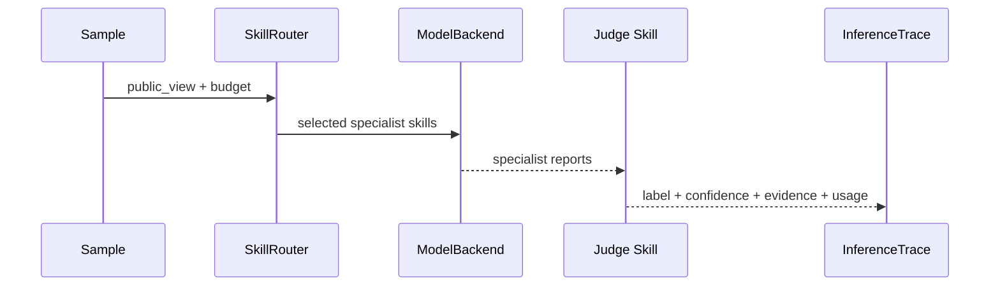
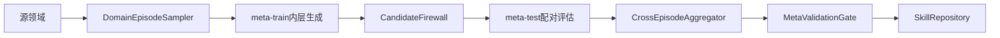

# EvoFactSkill 源码课程

> 分析快照：**NO-COMMIT · master · uncommitted working tree snapshot**  
> 生成日期：2026-09-07  
> 教学依据：静态源码、配置、测试和项目文档。未运行项目代码；“测试通过”不作为本课程的观察结论。

## 学习路线

这套课程用一条真实执行路径贯穿项目：用户运行 `meta-evolve`，系统把源领域划分为 meta-train 与 meta-test；内层在 meta-train 上生成候选技能，外层在 meta-test 上比较候选与基线，最后由门控决定是否提交到 SkillBank。

完成课程后，你应能解释普通推理与 DEMSE 进化的区别，追踪一次候选从生成到提交的全过程，并知道扩展数据集、技能或门控指标时要修改哪些位置。

---

## 模块一：项目定位与阅读地图

### 1.1 项目解决什么问题

EvoFactSkill面向跨域假新闻检测。底层语言模型保持冻结，项目把能力变化放在外部技能、路由和工作流上。DEMSE的核心规则是：候选在meta-train域生成，在没有参与生成的meta-test域接受检验。[源码：README.md:3](../../README.md#L3)

这决定了阅读顺序：先看命令入口，再看域情景，然后沿候选生成、迁移评估、门控和提交继续，而不是按目录逐个文件阅读。

### 1.2 仓库责任地图

```text
src/evofact/
├─ cli.py                 命令入口与流程分派
├─ core/models.py         跨层数据契约
├─ data/                  数据适配、清单、泄漏检查、域情景
├─ routing/ + runtime/    技能选择与一次事实核验
├─ attribution/           错误类型与技能贡献
├─ evolution/             蒸馏、候选、语义身份、防火墙
├─ validation/            指标聚合与门控决策
├─ experiments/           普通闭环与DEMSE编排
├─ skills/                技能加载、生命周期与版本库
└─ reporting/             JSON、Markdown、CSV报告
skills/seeds/             九个种子技能包
tests/                    普通链路与DEMSE不变量测试
```

构建元数据表明项目采用Python 3.11+、setuptools和src布局，并将 `evofact` 映射到 `evofact.cli:app`。[源码：pyproject.toml:1-19](../../pyproject.toml#L1)

### 1.3 先记住的边界

- 当前仓库没有Git提交，课程对应未提交工作树快照，后续行号可能变化。
-项目当前主要处理文本样本与结构化证据。没有视觉编码器或跨模态推理链，这是根据数据模型和运行时做出的静态推断。
- Mock后端用于验证流程，不等价于真实数据实验。[源码：README.md:5-15](../../README.md#L5)

**检查理解**：为什么本项目不能只从 `runtime/inference.py` 开始读？  
**答案**：它只能说明一次推理如何完成，不能解释候选技能如何获得跨域接受资格。

---

## 模块二：运行入口与信任边界

### 2.1 CLI如何把命令送入系统

`build_parser`定义数据、推理、普通进化、DEMSE和技能库命令。[源码：src/evofact/cli.py:22-32](../../src/evofact/cli.py#L22) `_run`读取配置与数据，再按 `args.command` 分派。[源码：src/evofact/cli.py:34-100](../../src/evofact/cli.py#L34)

对于 `meta-evolve`，CLI允许覆盖情景数、采样策略、meta-test域数和三个消融开关；`--evaluation-only` 阻止仓库提交。[源码：src/evofact/cli.py:65-78](../../src/evofact/cli.py#L65)

```text
CLI参数
  ↓
AppConfig + 数据样本
  ↓
MetaEvolutionRunner.run(...)
  ↓
MetaEvolutionOutcome + 三种报告
```

### 2.2 四条信任边界

1. 最终测试域不能进入任何情景。
2. meta-test轨迹和标签不能进入候选生成。
3. 候选技能不能修改评测器、数据或安全规则。
4. 只有通过门控的候选才能修改活动SkillBank。

配置中的 `min_valid_episodes`、`max_negative_transfer_rate`、`max_worst_domain_drop`、覆盖率和成本阈值构成外层政策。[源码：configs/default.yaml:16-33](../../configs/default.yaml#L16)

**检查理解**：`--resume`为什么不能无条件恢复旧检查点？  
**答案**：旧结果只有在配置、数据和SkillBank指纹一致时才可比较，否则聚合会混入不同实验条件。

---

## 模块三：普通推理与核心数据契约

### 3.1 一次新闻判定

`SkillRouter.select`先筛选活动或冻结的专家技能，再按策略选择。utility-aware策略综合适用域、触发词、边际效用、成本和负迁移计数。[源码：src/evofact/routing/router.py:4-22](../../src/evofact/routing/router.py#L4)

`InferenceRuntime.infer`依次调用专家后端，收集报告和异常，再调用Judge技能生成最终判定，最后返回带路由、版本、证据、成本与错误的 `InferenceTrace`。[源码：src/evofact/runtime/inference.py:6-18](../../src/evofact/runtime/inference.py#L6)



### 3.2 为什么 `core/models.py` 是项目骨架

跨模块没有传递任意字典，而是通过 `Sample`、`SkillSpec`、`InferenceTrace`、`DomainEpisode`、`EpisodeEvaluation`、`TransferUtility` 和 `MetaGateDecision` 建立契约。[源码：src/evofact/core/models.py:24-384](../../src/evofact/core/models.py#L24)

读复杂流程时，先看这些对象的字段，再看谁生产、谁消费。尤其要区分：

- `InferenceTrace`：一次样本推理的事实记录。
- `EpisodeEvaluation`：某候选在某一域情景的基线—候选比较。
- `TransferUtility`：同一语义候选跨情景的汇总。
- `MetaGateDecision`：是否接受，以及接受为全局技能还是特化技能。

**检查理解**：Judge技能为什么没有和普通专家一起由路由器选择？  
**答案**：路由器只筛 `SPECIALIST`，运行时随后单独寻找活动或冻结的 `JUDGE`；二者职责不同。

---

## 模块四：DEMSE端到端调用链

### 4.1 域情景采样

`DomainEpisodeSampler.build`按完整领域生成meta-train和meta-test集合，拒绝源域不足、源域与最终域重叠、meta-test域数过大等非法配置，并检查所有源域最终都被当作meta-test覆盖。[源码：src/evofact/data/episodes.py:14-52](../../src/evofact/data/episodes.py#L14)

### 4.2 从内层生成到外层门控

`MetaEvolutionRunner.run`是全项目最重要的编排函数。[源码：src/evofact/experiments/meta_runner.py:50-107](../../src/evofact/experiments/meta_runner.py#L50)

1. 分离源域与最终测试域，计算数据和SkillBank指纹。
2. 构造域级情景并加载可兼容检查点。
3. 在每个meta-train集合上调用 `evolve_once`。
4. 防火墙验证轨迹来源与候选内容。
5. 在meta-test样本上重复运行基线库和候选库。
6. 将逐情景结果按候选语义身份聚合。
7. 门控产生状态，最后执行批量原子提交。



### 4.3 三个最容易漏读的设计

- 候选身份不依赖随机proposal id，而由操作、父技能、规范化内容和作用域共同哈希。[源码：src/evofact/evolution/identity.py:13-25](../../src/evofact/evolution/identity.py#L13)
- 配对评估在同一meta-test样本上重复运行基线与候选，并给样本id附加重复编号。[源码：src/evofact/experiments/meta_runner.py:83-94](../../src/evofact/experiments/meta_runner.py#L83)
- `evaluation_only` 让完整门控运行，但不创建 `SkillRepository` 提交。[源码：src/evofact/cli.py:75-78](../../src/evofact/cli.py#L75)

**检查理解**：为什么按样本随机划分meta-train/meta-test不符合DEMSE？  
**答案**：同一领域的分布特征会同时出现在两侧，无法模拟未知领域迁移，也削弱防泄漏意义。

---

## 模块五：关键机制与质量模型

### 5.1 候选防火墙

`build_generation_view`只接受属于meta-train样本的轨迹和归因；`validate_candidate`把候选序列化后检查是否包含meta-test或最终域样本标识与较长规范化文本。[源码：src/evofact/evolution/firewall.py:9-39](../../src/evofact/evolution/firewall.py#L9)

这是一道启发式防线，不是形式化的信息流安全证明。扩展候选生成器时，仍应只把 `MetaTrainView` 暴露给模型。

### 5.2 跨情景聚合与元门控

`CrossEpisodeAggregator`计算macro-F1平均增益、bootstrap区间、正迁移率、负迁移率、最差域增益、覆盖、ECE变化和成本比。[源码：src/evofact/validation/transfer.py:23-67](../../src/evofact/validation/transfer.py#L23)

`MetaValidationGate`依次检查安全、有效情景数、平均增益、区间、负迁移、最差域、覆盖、成本和校准。全局条件失败时，候选仍可能成为 `specialized` 或进入Pareto档案。[源码：src/evofact/validation/meta_gate.py:7-49](../../src/evofact/validation/meta_gate.py#L7)

### 5.3 原子版本库与恢复

`SkillRepository`用技能内容的SHA-256作为快照名，先写临时文件再 `os.replace`，活动映射和事件日志支持晋升、冻结、退役与回滚。[源码：src/evofact/skills/repository.py:20-73](../../src/evofact/skills/repository.py#L20)

`MetaCheckpointStore`恢复前验证配置、数据和技能库三个指纹；保存同样采用临时文件替换。[源码：src/evofact/experiments/checkpoint.py:17-41](../../src/evofact/experiments/checkpoint.py#L17)

### 5.4 测试告诉我们的质量边界

测试源码静态包含31个 `test_` 方法，其中11个专门覆盖DEMSE。它们检查域互斥与覆盖、防火墙、语义身份、聚合消融、状态门控、检查点与原子提交。[源码：tests/test_demse.py:28-119](../../tests/test_demse.py#L28)

注意：测试代码证明“项目声明了这些不变量并写了验证”，只有实际运行后才能把它们标成observed。

**检查理解**：平均增益为正时，候选为什么仍可能无法generalize？  
**答案**：置信区间可能包含0，也可能违反负迁移、最差域、覆盖、成本或校准约束。

---

## 模块六：安全扩展与练习

### 6.1 添加数据集适配器

实现 `DatasetAdapter`，在 `DataRegistry` 注册，并补充清单与泄漏测试。重点不是把文件读成列表，而是正确映射 `sample_id`、领域、事件、发布时间和证据时间。

### 6.2 添加技能

在 `skills/seeds/<name>/SKILL.md` 创建符合加载器契约的包。新增专家技能后，检查路由触发条件、scope和预算；新增Judge则必须保证运行时仍能唯一选取预期判决器。

### 6.3 添加门控指标

一项新指标通常跨越四层：`EvaluationResult`字段或指标实现、`EpisodeEvaluation`差值、`CrossEpisodeAggregator`聚合、`MetaValidationGate`阈值。还要更新配置解析与针对性测试。

### 6.4 递进练习

1. **定位**：找出 `--evaluation-only` 阻止写入SkillBank的位置。
2. **追踪**：从CLI的 `meta-evolve` 跟到 `MetaGateDecision`，记录每个中间对象。
3. **设计**：为“证据精确率下降不得超过2%”设计数据字段与门控分支，不修改代码。
4. **验证**：列出至少四个测试，覆盖全局接受、领域特化、严重负迁移和恢复指纹不匹配。

### 常见误解

- **“meta-test用于训练候选”**：错误。它只评价并控制接受。
- **“这是MAML”**：错误。代码不计算元梯度，更新对象是离散SkillBank。
- **“Mock的0.3333增益是模型性能”**：错误。Mock值只验证机制。
- **“仓库是多模态系统”**：当前不是。结构化证据不等于图像、音频与视频联合建模。
- **“有测试就等于测试已通过”**：静态分析只能确认测试存在。

### 术语表

| 术语 | 含义 |
|---|---|
| SkillBank | 可版本化的外部技能集合 |
| DomainEpisode | 一次meta-train/meta-test域划分及其样本清单 |
| CandidateFirewall | 阻断留出域信息进入候选的边界检查 |
| CandidateIdentity | 跨情景聚合同义候选的稳定语义指纹 |
| TransferUtility | 候选跨情景的迁移统计摘要 |
| MetaGateDecision | 候选最终状态与目标领域 |
| Pareto | 在准确性、覆盖和成本等维度上不可支配的备选 |

### 完成检查

- [ ] 我能定位CLI、普通推理和DEMSE入口。
- [ ] 我能解释meta-train、meta-test和final-test的权限差异。
- [ ] 我能追踪候选从错误归因到门控提交。
- [ ] 我能解释generalized、specialized和pareto的分歧条件。
- [ ] 我能为新增数据集、技能或指标列出受影响模块与测试。
